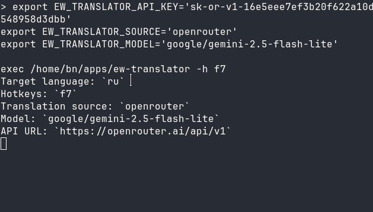

# ew-translator

> **Instant, lightweight popup translator right at your fingertips.**  
> Select text in any application, press a global shortcut, and view the translation instantly next to your pointer.



## Why ew-translator?

- **⚡ Lightning Fast & Pure Rust** — Instant startup and minimal memory footprint. No heavy web engines, Electron, or WebKit.
- **🎯 Smart Adaptive Popup** — The window automatically hugs the content. A tiny badge for single words, a comfortable card for sentences, and a smooth scrollbar for long articles.
- **🖥️ Multi-Monitor & Edge Aware** — Never goes off-screen. Intelligently flips upward when invoked near the bottom of your display and stays clamped within your monitor's bounds.
- **✨ Seamless UX** — Copy translated text with standard selection (`Ctrl+C`). Dismiss with a single click outside or `Esc`.
- **🤖 Modern AI & Traditional Providers** — Works out-of-the-box with Google Translate (zero setup), or connect Google Gemini, OpenRouter, OpenAI, or local LLMs (Ollama, LM Studio).

---

## Quick Start

Launch `ew-translator` with your preferred hotkey and target language:

```sh
# Default: Russian translation with F7 hotkey
ew-translator -h f7

# Translate into English with Alt+T
ew-translator -l en -h 'ALT+T'
```

Select text anywhere on your screen and press your hotkey!

---

## Translation Providers

### 1. Google Translate (Default)
Ready to use immediately with zero configuration:
```sh
ew-translator -h f7
```

### 2. Google Gemini
Translate using Gemini's fast models (defaults to `gemini-2.5-flash-lite`):
```sh
export EW_TRANSLATOR_SOURCE='gemini'
export EW_TRANSLATOR_API_KEY='your-gemini-key'
ew-translator -h f7
```

### 3. OpenRouter
Access hundreds of models (e.g. `google/gemini-2.5-flash-lite`, Claude, Llama):
```sh
export EW_TRANSLATOR_SOURCE='openrouter'
export EW_TRANSLATOR_API_KEY='your-openrouter-key'
export EW_TRANSLATOR_MODEL='google/gemini-2.5-flash-lite'
ew-translator -h f7
```

### 4. OpenAI & Local LLMs
Use OpenAI directly or any OpenAI-compatible endpoint (like Ollama or LM Studio):
```sh
export EW_TRANSLATOR_SOURCE='openai'
export EW_TRANSLATOR_API_KEY='your-key'
export EW_TRANSLATOR_MODEL='gpt-4o-mini'
# For local LLMs, add your API URL:
# export EW_TRANSLATOR_API_URL='http://localhost:11434/v1'
ew-translator -h f7
```

---

## Installation

### Prebuilt Binaries
Download the latest prebuilt binary from [Releases](https://github.com/bnku/ew-translator/releases):
```sh
install -m 755 ew-translator ~/.local/bin/ew-translator
```

### Build from Source
Ensure you have Rust and Cargo installed:
```sh
git clone https://github.com/bnku/ew-translator.git
cd ew-translator
cargo build --release
install -m 755 target/release/ew-translator ~/.local/bin/ew-translator
```

---

## Configuration

Settings can be specified via **CLI flags**, **environment variables**, or an **optional configuration file** (`~/.config/ew-translator/config.toml`):

| Option | Environment Variable | Description | Default |
| --- | --- | --- | --- |
| `-l`, `--lang` | `EW_TRANSLATOR_LANG` | Target language code | `ru` |
| `-h`, `--hotkeys` | `EW_TRANSLATOR_HOTKEYS` | Global activation shortcut | `CTRL+SHIFT+F7` |
| `-s`, `--source` | `EW_TRANSLATOR_SOURCE` | Provider (`google-translate`, `gemini`, `openrouter`, `openai`) | `google-translate` |
| `-m`, `--model` | `EW_TRANSLATOR_MODEL` | Model ID (for AI providers) | Provider default |
| `-u`, `--api-url` | `EW_TRANSLATOR_API_URL` | Base API URL | Provider default |
| | `EW_TRANSLATOR_API_KEY` | Provider API key | None |
| `-c`, `--config` | `EW_TRANSLATOR_CONFIG` | Path to custom config file | `~/.config/ew-translator/config.toml` |

### Optional Config File Example
`~/.config/ew-translator/config.toml`:
```toml
source = "openrouter"
api_key = "sk-or-v1-..."
model = "google/gemini-2.5-flash-lite"
lang = "ru"
hotkeys = "F7"
```

---

## License

GPL-3.0
